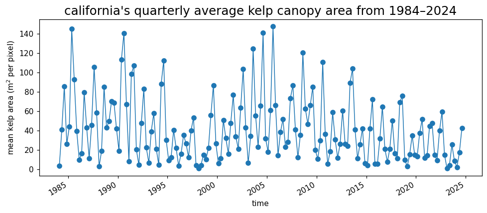
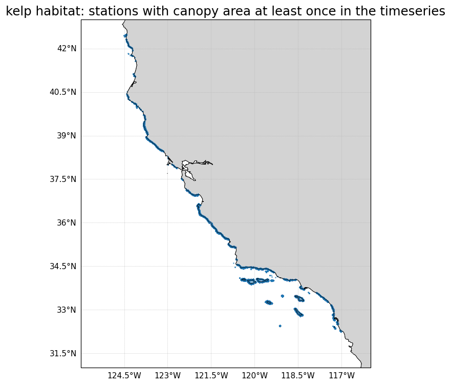
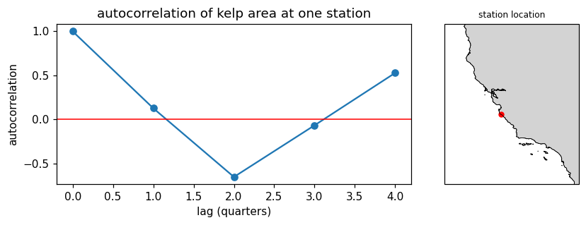
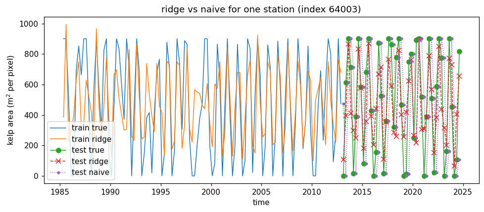
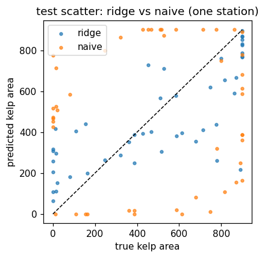
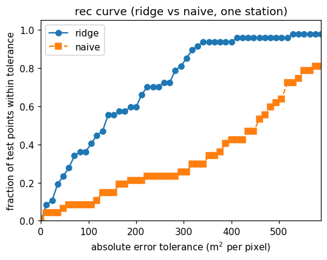
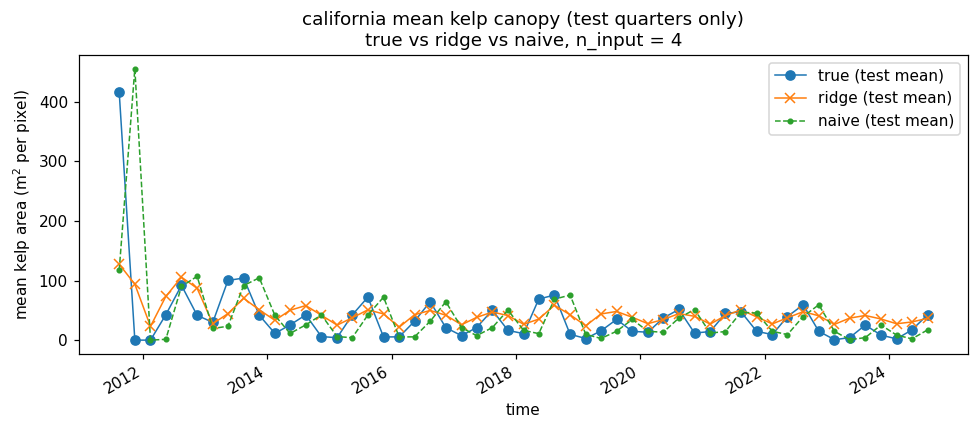
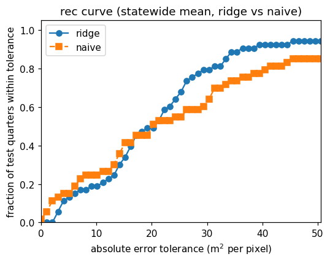

# Forecasting California kelp canopy with simple machine learning

_AOS C111 / C204 – Final Project_  
_Lori Aznive Berberian_

---

## 1. Motivation
Giant kelp (_Macrocystis pyrifera_), bull kelp (_Nereocystis_), and other canopy-forming macroalgae create structurally complex, productive habitats along the California coast. Their surface canopy area changes over time with waves, storms, marine heatwaves, and land–ocean connections such as freshwater and sediment runoff.

For my PhD research, I am interested in how changes in water clarity and light availability affect shallow benthic habitats and canopy-forming kelps, especially during events like high river discharge, post-fire runoff, and marine heatwaves. To say whether these events have an “impact,” I first need a baseline expectation for how kelp canopy would change in their absence.

Most kelp models in the literature include many environmental drivers (waves, temperature, nutrients, upwelling, etc.). Here, I intentionally use a much simpler setup that fits the scope of this ML class and ask:

> **How much of kelp canopy variability along California can we predict using only kelp’s own recent history?**

If a simple, regularized linear model using only past canopy explains a large fraction of variance, that gives a strong null model. Later, I can interpret deviations from this baseline in terms of changes in light, turbidity, or other drivers.

---

## 2. Data
This project uses a statewide Landsat-derived kelp canopy product from the KelpWatch / SBC LTER team:

- KelpWatch portal: <https://kelpwatch.org/>  
- SBC LTER Landsat kelp canopy dataset:  
  <https://sbclter.msi.ucsb.edu/data/catalog/package/?package=knb-lter-sbc.74>

The dataset is gridded at 30 m resolution. Each coastal pixel is treated as a separate **station** and followed over many years at regular quarterly time steps. The main variable is kelp canopy area per pixel per quarter (units: m²).

In code, the data are stored in an `xarray.Dataset` with dimensions:

- `station` – Unique coastal pixel ID  
- `time` – Quarterly time steps  

and coordinates `latitude(station)` and `longitude(station)`. I subset to a California lat/lon box and keep only stations that have non-zero canopy at least once, so I focus on locations where kelp actually occurs.

Before fitting models I :
1. Worked with the cleaned quarterly canopy time series for each station.  
2. Treat missing values as “no observation” rather than true zero canopy.  
3. Drop stations with too few valid observations to support a history window.  

Below are two simple figures summarising the data set:


**Figure 1.** California’s quarterly average kelp canopy area from 1984–2024 (mean m² of canopy per pixel over all California stations).



**Figure 2.** Kelp habitat along the California coast: Stations where canopy area is non-zero at least once in the time series.

---

## 3. Methods
For each station `i` and time `t`, the input is a vector of past canopy values over a fixed number of quarters (a history window), and the target is the canopy at the next quarter at the same station:

- Input:  
  `x[i,t] = [y[i,t-1], y[i,t-2], ..., y[i,t-k]]`  

- Target:  
  `y[i,t] = kelp canopy at time t`  

Here `k` is the length of the history window (in most runs, 4 quarters ≈ 1 year).

As a simple baseline, I define a naive **persistence** model that just copies the last observation:

\[
\hat{y}_{\text{naive}}[i,t] = y[i,t-1].
\]

The main ML model is **ridge regression**, a linear model with L2 regularization on the coefficients. In scikit-learn form:

```python
from sklearn.linear_model import Ridge

model = Ridge(alpha=alpha)
model.fit(X_train, y_train)
y_pred_ridge = model.predict(X_test)
```
The regularization strength, alpha, controls how strongly the coefficients are shrunk toward zero, which helps prevent overfitting when the history window is long relative to the number of training samples. I build the model using a helper function make_ridge_model from kelp_ml_utils, which sets up the ridge estimator and scales the data by the subtracting the mean and deviding by the standard deviation. I then split the data by time. Early years are used for training and later years are held out for testing. 

I first apply this pipeline to a single station with large mean canopy. For that station I compute: A time-series comparison of train/test true vs ridge vs naive, A test scatter plot of true vs predicted canopy, and a regression error characteristic (REC) curve comparing ridge vs naive. The representative station is chosen as the one with the largest mean canopy over the record. Its autocorrelation function and location are shown below:



**Figure 3.** Autocorrelation of kelp canopy at one high-biomass station (left) and its location along the California coast (right). Autocorrelation is strong at lag 1 and decays with lag, supporting the use of recent history as a predictor.

I then run the same ridge setup for every California station using run_ridge_all_stations, which: Fits ridge at each station, computes per-station RMSE and R² for ridge and RMSE for the naive baseline, and aggregates statewide test-mean time series for the true, ridge, and naive predictions. Finally, I compute scatter plots and REC curves using the statewide mean canopy over all stations for each test quarter. This lets me compare ridge vs naive at both the local (single station) and global (statewide mean) scales.

---
## 4. Results
Single-station behavior: For the representative station, the ridge model follows the expected boom–bust cycles and tends to be closer to the test observations than the naive model. Figures 4–6 summarize this behavior.



**Figure 4.** Ridge vs naive for one station. Ridge uses four quarters of history. During the test period, ridge (red x and dashed line) generally stays closer to the observed canopy (green circles) than the naive model (purple dotted line), especially during moderate canopy fluctuations.




**Figure 5.** Test scatter for the same station. Ridge predictions (blue points) cluster closer to the 1:1 line than naive predictions (orange points), which show larger over- and underestimates, particularly at intermediate and high canopy values.




**Figure 6.** REC curve (ridge vs naive, one station). The ridge curve lies above the naive curve for most absolute-error tolerances between ~50 and 500 m² per pixel, indicating that a larger fraction of quarters are predicted within any given tolerance when using ridge.


Statewide average behavior: To examine performance at the statewide level, I aggregate kelp canopy over all California stations and examine the statewide mean canopy for the test quarters. Figures 7–9 compare ridge and naive at this scale.


**Figure 7.** California mean kelp canopy (test quarters only). Ridge (orange) generally tracks the observed mean (blue) more closely than naive (green), particularly after large spikes where persistence struggles.




**Figure 8.** Statewide mean canopy: True vs predicted. Ridge predictions (blue points) lie closer to the 1:1 line than naive predictions (orange points), which show more extreme deviations, especially at high canopy values.




**Figure 9.** REC curves for the statewide mean canopy. For almost all tolerances up to ~50 m² per pixel, the ridge curve (blue) lies above the naive curve (orange), meaning ridge encloses a larger fraction of test quarters within a given absolute error tolerance. This indicates that, when judged on the mean canopy over California, the ridge baseline is more accurate and more reliable than copying the last quarter.

---
## 5. Discussion
This project shows that a simple, regularized linear model using only kelp’s own recent history can provide a useful predictive baseline for kelp canopy dynamics along the California coast. At the single-station level, ridge often improves on a naive persistence predictor and captures much of the low-frequency variability. It performs especially well for moderate canopy values and smoother boom–bust cycles, although it can still miss sharp declines or very large peaks. At the statewide mean level, ridge again outperforms the naive model: global test RMSE is lower, the statewide mean time series is closer to observations, and the REC curve shows a higher fraction of quarters within any given error tolerance. However, the improvements are modest when averaged over all pixels and all times, reflecting the mix of predictable and highly variable sites.

The results support the idea that kelp canopy has strong temporal autocorrelation and inertia: recent states carry a lot of information about the near future, particularly in persistent beds. The lag coefficients (not shown here) place most weight on the most recent quarter and smaller weights on earlier lags, which is consistent with this conclusion. The ridge model functions as a “history-only” null model for impact studies. Instead of comparing kelp only before and after an event, I can compare the observed trajectory to what the history-based model would have predicted in a no-disturbance world. If a disturbance that changes water clarity and light (for example, wildfire-driven runoff that increases turbidity) leads to kelp losses much larger than the ridge baseline would expect, that is evidence of a real impact. If observed changes fall within the baseline’s expected variability, then attributing them to a specific event becomes less convincing. 

---
## 6. Limitations and future work
There are several clear limitations to this simplistic modeling appraoch. First, there are no explicit environmental drivers in the model. Waves, sea surface temperature, nutrients, and runoff are not included, so the model can say what is predictable from history alone but not why canopy changes. Second, the focus is on single-step forecasts (one quarter ahead). Multi-step forecasts over two to four quarters would be useful to understand how quickly errors grow and how far into the future a history-only model remains useful. Third, by pooling all stations into a single set of ridge hyperparameters, I implicitly assume that the same mapping from history to future applies everywhere, even though processes clearly differ by region, exposure, and depth. Some stations may benefit from stronger or weaker regularization or different history lengths.

Future work could improve upon the model by encorporating covariates (e.g., SST anomalies, wave height, and runoff data) to the history features inorder to see how much they improve performance over the history-only baseline. Region-specific or hierarchical ridge models could allow coefficients to vary along the coast while still sharing information. 

---
## 7. Code and reproducibility
All of the analysis for this project is implemented in a python notebook and a small utility script. They can be accessed here:

main notebook (analysis and figures): kelp_ridge_baseline_v3.ipynb
utility functions: kelp_ml_utils.py

the main tools used include:
- xarray to handle the (station, time) grid of kelp canopy
- numpy and pandas for general data manipulation
- scikit-learn for ridge regression and evaluation metrics

kelp_ml_utils includes functions which:
- turn kelp time series into supervised learning windows (make_supervised)
- split data into training and testing periods along the time axis (train_test_split_time)
- build ridge models with consistent settings (make_ridge_model)
- fit ridge models across all stations and compute global and per-station metrics (run_ridge_all_stations)
- compute rec curves for comparing models at single-station and statewide scales (rec_curve)

---
## 8. Conclusion
Even a very simple machine learning model that only uses kelp’s own recent history can capture much of the short-term variability in kelp canopy along the california coast. At individual pixels the ridge model sometimes performs quite well, but performance is more mixed when averaged statewide. This history-only ridge model is easy to explain, fast to run, and provides a clear yardstick for evaluating the added value of more complex or multi-driver models.

---
## 9. References

Bell, t., k. cavanaugh, d. siegel. 2025. sbc lter: time series of quarterly netcdf files of kelp biomass in the canopy from landsat 5, 7 and 8, since 1984 (ongoing) ver 30. environmental data initiative. https://doi.org/10.6073/pasta/2f4c9f58fd6f219c9b97fd35f339e679
. accessed 2025-11-29.


